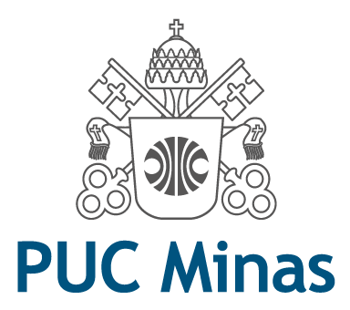

<h1 align="center">
    
</h1>

<h3 align="center">
  Laboratório de Desenvolvimento de Software - Projeto 2
</h3>

Workspace do segundo modulo, da disciplina de Laboratório de Desenvolvimento De Software 🎓

  

  	
	

 

## :card_index_dividers: Índice de diretórios

[0. Diretório de Imagens usadas no Markdown](https://github.com/guilhermejulio/LDS-Lab02/tree/main/.github)

[1. Diretório de Projeto ](https://github.com/guilhermejulio/LDS-Lab02/tree/main/projects)

[2. Diretório de Implementação ](https://github.com/guilhermejulio/LDS-Lab02/tree/main/implementation)

## 🚀 Descrição do Sistema

Os alunos que desejam ingressar no sistema de mérito devem realizar um cadastro, indicando nome, email, CPF, RG, Endereço, Instituição de Ensino e curso. As instituições participantes já estão pré-cadastradas no sistema, para que o aluno selecione.

Os professores já estarão pré-cadastrados no sistema (a instituição envia a lista no momento da parceria). Cada professor terá armazenado o seu nome, CPF e departamento que está vinculado. É necessário deixar explícito que ele faz parte de uma instituição.

A cada semestre, os professores recebe um total de mil moedas, que podem ser distribuídas aos seus alunos como forma de reconhecimento por bom comportamento, participação em aula, etcs. Esse total é acumulável no semestre (isto é, se o professor não distribuir todas as moedas num semestre, o total de 1.000 novas moedas será adicionado ao seu saldo corrente).

Para enviar moedas, o professor deve possuir saldo suficiente, indicando qual aluno deverá receber o montante, bem como o motivo pelo qual ele está sendo reconhecido (uma mensagem aberta, obrigatória).

Ao receber uma moeda, o aluno deve ser notificado por email. 

Professores e alunos devem ser capazes de consultar o extrato de sua conta, visualizando o total de moedas que ainda possui, bem como as transações que realizou (para o professor, o envio de moedas; para o aluno, recebimento ou troca de moedas).

Para trocar moedas, o aluno deve selecionar uma das vantagens cadastradas no sistema. Elas incluem, por exemplo: desconto em restaurantes da universidade, desconto de mensalidade, ou compra de materiais específicos.

Empresas que sejam realizar parceria também devem se cadastrar no sistema, incluindo as vantagens que deseja oferecer e o custo de cada uma dela (em moedas).

Para cadastrar uma vantagem, a empresa parceira deve adicionar também uma descrição e foto do produto.

Ao resgatar uma vantagem, o aluno deve ter o valor descontado do seu saldo. Um email de cupom deve ser enviado para que ele utilize na troca presencial. Um email também deve ser enviado ao parceiro, para que ele possa conferir a troca. Ambos os emails devem incluir um código gerado pelo sistema, a fim de facilitar o processo de conferência.

Por fim, alunos, professores e empresas parceiras precisam ter um login e uma senha cadastrados para acessar o sistema. Em todos os casos, um processo de autenticação é necessário para realização dos requisitos.

 
   
## 📃️ Apresentação Final

Ao final da última sprint (Sprint 04), os alunos deverão apresentar o protótipo produzido, comparando-os com os modelos descritos inicialmente, bem como apresentando as modificações inseridas para o funcionamento adequado do software (conforme a especificação anterior). Além disso, ao final da Sprint 02, cada grupo deverá apresentar um tutorial das tecnologias escolhidas para desenvolver o sistema. A ideia é promovermos um salão de tecnologias na aula. Cada apresentação deve ter 25-30 min de duração. Ela fará parte da especificação da Sprint 02.

O sistema deverá ser desenvolvido utilizando arquitetura MVC, e atendendo aos requisitos apresentados e cumprindo a modelagem produzida nas sprints iniciais do projeto. O repositório GitHub deve estar atualizado, com todas as versões produzidas dos modelos UML e o código final desenvolvido. A avaliação final do projeto levará em consideração os seguintes aspectos:

Qualidade do sistema produzido (adequação aos requisitos apresentados);
Alinhamento entre modelo (de classes e de arquitetura) e código;
Atualizações dos modelos conforme necessidade do projeto.

 

## 📍️ Processo de Desenvolvimento

- Lab01S01: Lab03S01: Modelagem do sistema: Diagrama de Casos de Uso, Diagrama de Classes, Diagrama de Componentes, Diagrama de Implantação, Mapeamento do Diagrama de Classe para o Modelo ER. Diagrama de Interações (sequência e comunicação) para o CRUD de alunos e empresas parceiras.

- Lab03S02: TBD;

- Lab03S03: TBD;

- Lab03S04: TBD;

- Prazo final: 31/05 | Apresentação: 01/06 | Valor total: 35 pontos | Desconto de 1 ponto por dia de atraso

 

## :memo: Licença

Esse projeto está sob a licença MIT. Veja o arquivo [LICENSE](LICENSE) para mais detalhes.

